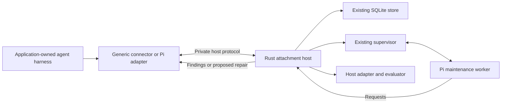

# Runtime integration implementation plan

Status: P1–P3 implemented locally, with attachment-focused P6 qualification. P4–P5 remain proposed follow-on work. See [validation](validation.md) for observed results and limits.

The accepted [reliable behavioral learning pass](plans/reliable-behavioral-learning/README.md) now owns the follow-on implementation. Its R5 covers P4 memory/retrieval, and R6 covers P5 complete-agent experiments. R1–R3 establish the required lifecycle and accounting guarantees first; the seven PRDs are the current requirements.

Prepared for Theo on 12 September 2026 from the current v0.1 implementation.

The core delivery is easy integration with an agent harness: connect Ribosome when the harness starts, receive evidence-backed findings during execution, and optionally coordinate checked repairs. Attaching partway through an execution is an additional supported path, not a prerequisite. The integration contract is independent of the agent framework. Memory/retrieval improvements and comparisons of complete agent executions are separate follow-on work. They do not block delivery of attachment.

Delivered: generic host protocol/client, Pi adapter, durable event routing, feedback and optional steering, cooperative checked repair, migration, recovery checks and an independently installed consumer. No new production dependency was added. P4–P5 are not implemented by this delivery.

## Scope and decisions

| Decision | Proposed implementation | Reason |
| --- | --- | --- |
| Integration contract | A framework-independent event source and feedback callback, bound to a host-owned execution | Any harness with appropriate hooks can implement the same contract without adopting Ribosome's agent loop. |
| First connector | An application-owned Pi `Agent`, connected before execution by default | The installed Pi version already exposes subscriptions and steering. It is the first adapter, not a dependency of the generic attachment contract. |
| Mid-run connection | The same interface with an explicit starting coverage window | Useful for existing executions, with honest limits on earlier observations. |
| First attachment capability | Observe and return findings | Useful on its own; does not depend on control over the external agent's writes. |
| Local transport | An explicitly started Rust host process over private stdio, with a TypeScript client | Fits the current process boundary and Node consumers without requiring a network service. |
| State authority | Existing Rust SQLite database and host-selected `state_dir` | Reuse runs, work, events, records, receipts and accounting. |
| Scheduling | A cancellable event/poll/dispatch loop owned by the explicitly started host | Imports remain passive; the host owns shutdown and resource limits. |
| Shared changes | Cooperative handoff at a verified tool boundary | Artifact hashes alone cannot make concurrent multi-file application safe. |
| Memory | Existing record format, with explicit consolidation triggers and source-version checks | Improve when knowledge is saved and used before introducing another storage system. |
| Retrieval | Measure current FTS5, then improve lexical ranking and query formulation | Vector search is conditional on demonstrated semantic retrieval failures. |
| Experiments | Host evaluator executes the actual reference agent with matched budgets and independent checks | Existing procedure comparisons do not establish benefit over agent retry or critique. |

Pi is the first reference adapter, not a claim that Codex or another framework already has a connector. Prove the generic contract with a small custom harness conformance fixture as well as Pi. Named framework adapters follow actual host requests. The integration must accept an application-owned agent before or during execution; it must not secretly replace that agent with a Ribosome worker. A harness with no event or lifecycle hooks needs instrumentation before it can participate. Language-independent JSON contracts allow non-TypeScript consumers; additional language SDKs are separate deliverables.

No new production dependency was added. Cloud hosting, distributed scheduling, a broker, an external database, arbitrary process injection, automatic credential discovery and an OS sandbox are outside this delivery. Existing released or documented commands retain their behaviour. The current API and runnable examples are in the [integration guide](attachments.md).

## Baseline used to identify the gaps

| Area | v0.1 baseline | Planned change |
| --- | --- | --- |
| Persistence | [store.sql](../crates/ribosome-core/src/store.sql) retains operational state; [store.rs](../crates/ribosome-core/src/store.rs) accepts schema version 1 | Add only attachment state and external delivery state that have no existing representation; provide a tested migration. |
| Events | [evidence.rs](../crates/ribosome-core/src/evidence.rs) validates and deduplicates events by identity and producer sequence | Add connector mapping, acknowledged batches, explicit coverage and source execution binding. |
| Routing | [subscriptions.rs](../crates/ribosome-core/src/subscriptions.rs) starts at cursor zero and reads all visible runs in a scope | Add execution selection and explicit start position; make queue insertion and subscription advancement atomic. |
| Dispatch | [supervisor.rs](../crates/ribosome-core/src/supervisor.rs) runs workers and drains leased work | Add a managed attachment loop, lifecycle controls and bounded backlog. |
| Responsiveness | Worker tool calls take the shared runtime mutex; synchronous effects and experiments can retain it while commands run | Use a separate connection to the same database for ingestion/status; preserve serialized effects. |
| External feedback | [communication.rs](../crates/ribosome-core/src/communication.rs) addresses Ribosome runs sharing a grant | Add external delivery and acknowledgements without pretending an external execution is a Ribosome run. |
| Write coordination | [host.rs](../crates/ribosome-core/src/host.rs) locks out other Ribosome hosts and checks artifact versions | Cooperate with external writers before applying a repair. |
| Memory and search | [records.rs](../crates/ribosome-core/src/records.rs) stores, expires and invalidates memory; search uses literal AND terms and ID ordering | Add bounded lifecycle triggers, usable retrieval evaluation and evidence-version handling. |
| Experiments | [experiments.rs](../crates/ribosome-core/src/experiments.rs) executes host evaluators with frozen studies and isolated directories | Add an evaluator for actual external agent executions and account for all participating agents. |

The scheduling and locking observations identify work needed for attachment; they are not reproduced defect reports. Implementation must first add focused reproductions for the affected crash and concurrency boundaries.

## Runtime and contract design



The host protocol and maintenance-worker protocol have different authority. Share framing and generated schemas where useful, but give the host protocol its own method allowlist and handshake. A model-facing worker must never gain attachment administration or permission-management tools by sharing transport code.

The implemented entry points are `ribosome host CONFIG.json`, `AttachmentClient.attach(options)`, and `attachPi(client, agent, options)`. The generic client and wire contract must not expose Pi-specific types. Rust consumers call the same attachment orchestration directly. Implement the orchestration once; the CLI, generic client and Pi adapter use it.

The intended consumer experience is a small startup integration. This is an API sketch, not runnable code:

```ts
const attachment = await client.attach({
  executionId: task.id,
  source: harnessEvents, // Adapts the harness's lifecycle/tool observations.
  onFeedback: feedback => harness.present(feedback),
});

try {
  await harness.run(task);
  await attachment.finish();
} finally {
  await attachment.detach();
}
```

`client` is already connected to the configured Rust host and its grant. A minimum integration supplies execution identity, a source that subscribes/unsubscribes to normalized events, and a structured feedback handler. The source reports completion/failure as well as task and tool boundaries. Versioned artifact access, steering and coordinated writes are optional declared capabilities. Consumers do not need to add a second model loop or persist Ribosome state themselves. Callback and async-iterator harnesses should map to this one event-source contract.

Minimum host methods cover open/resume, append events, inspect status, receive/acknowledge feedback and detach. Optional external steering and coordinated application are introduced only in their delivery phases.

| Contract | Required meaning |
| --- | --- |
| `Attachment` | Attachment ID; client/project; connector name/version; external execution ID; bound grant ID; lifecycle state; explicit starting coverage; advertised host capabilities. |
| Execution binding | Link maintenance runs and their work to an attachment and observed external execution. External execution IDs and maintenance run IDs remain distinct. |
| Event batch | Stable event identities, producer sequences and versions, external execution binding, bounded payload and durable acknowledgement. A source cursor and SQLite ingestion cursor are separate values. |
| Feedback | Stable ID, target attachment, finding/proposal references, supporting evidence and artifact versions, validity conditions, delivery state and host acknowledgement. |
| Status | Source coverage and gaps, last acknowledged ingestion, pending work, active maintenance, pending feedback, grant consumption and last actionable error. |

Use existing `events`, `work`, `runs`, `records` and `effects` for their current concepts. Add `attachments` and `attachment_feedback` tables, plus execution bindings on work/runs/subscriptions as required. External delivery cannot use the current `messages` table unchanged because its recipient and grant rules describe internal run communication.

Attachment lifecycle is `active`, `interrupted`, `detached` or `completed`. Store the observed external execution status separately; losing the connector does not prove the external agent stopped. A restart marks active attachments interrupted until the connector re-establishes source position and authority. Reconnection must not reset budgets, expand grants or create a fresh history silently.

Database changes use an explicit transactional schema-1-to-2 migration under host ownership. Preserve existing rows and checkpoints, reject newer unknown schemas and test restart after migration. Keep FTS5 rebuildable from current records. Recovery backups must capture SQLite consistently, including WAL state, rather than copying a live database file alone.

## Communication contract and recommended practices

Use structured, asynchronous messages. The harness retains ownership of its execution and chooses where advice enters its user interface or agent context. Receiving a finding does not itself permit tool execution or a change in instructions.

| Message | Direction | Contract |
| --- | --- | --- |
| Observation | Harness → Ribosome | What the source reported, with event identity, execution/producer, sequence, causal references and artifact versions where available. Tool results are distinguished from an assistant's claim about a result. |
| Finding | Ribosome → harness | What was identified, supporting record/evidence references, uncertainty, affected artifacts and validity conditions. The host may present or defer it. |
| Intervention proposal | Ribosome → harness | Requested changes and their preconditions, checks, expected effects and fallback. It grants no new authority. |
| Control request | Between the host and a capable connector | Explicitly authorized steering, cancellation or writer handoff, addressed to a particular execution with deadline and request ID. Unsupported control is rejected. |
| Receipt | Receiver → sender | Durable delivery or actual execution outcome. Delivery accepted, steering queued and repair verified are distinct outcomes. |

Implementation rules:

1. Negotiate protocol version and capabilities at connection time. Support observation and feedback without requiring steering or write control. Changing capabilities requires an explicit host operation within the existing grant.
2. Preserve stable message IDs across retries. Use separate correlation and causal-parent references; timestamps alone do not establish order. Retain per-producer sequencing rather than inventing a total order across agents.
3. Acknowledge evidence only after persistence. Use bounded at-least-once transport where the producer can replay, with idempotent storage and explicit gaps when it cannot. Never advertise exactly-once external effects.
4. Keep ingestion acknowledgements independent of reasoning latency. Batch completed transitions, bound queue size and callback latency, and report backpressure. A lost attachment may degrade to observation unavailable while the source continues; uncertain coordinated writes must stop.
5. Deliver advice at host-selected task/turn/tool boundaries. Include validity conditions and reject stale advice. Prevent automatic feedback cycles with origin/correlation metadata and bounded work budgets.
6. Treat source text and model-authored findings as attributed data. Only the host issues authority; messages cannot promote themselves to trusted instructions or independently verified receipts.
7. Capture lifecycle metadata by default and deliberately select the artifact excerpts or message content needed for an investigation. Keep large content behind bounded artifact reads. Omitted evidence produces explicit uncertainty. Exclude credentials and provider reasoning; redact at the connector before persistence.
8. Retain optional trace/span correlation when supplied by a harness, without using a trace ID as an execution ID or treating a trace as a command channel. A trace-only integration supports observation; richer maintenance requires actual artifact and control hooks.

These are Ribosome design decisions informed by existing practices. CloudEvents defines stable source-plus-event identity for duplicate delivery; reuse that principle without changing the existing event format or claiming CloudEvents compliance. See the [CloudEvents 1.0.2 specification](https://github.com/cloudevents/spec/blob/v1.0.2/cloudevents/spec.md).

Explicit capability negotiation and host control of connection lifecycle are established in the [MCP architecture](https://modelcontextprotocol.io/specification/2025-06-18/architecture). Use those principles for the host protocol. An MCP tool/resource adapter could be added for a named consumer, but merely exposing a tool does not supply that consumer's execution events or safe write handoff. This plan does not implement or claim MCP protocol compatibility.

Selective content capture is consistent with [OpenTelemetry's GenAI content guidance](https://github.com/open-telemetry/semantic-conventions-genai/blob/main/docs/gen-ai/gen-ai-spans.md), which recommends opting into message content. Preserve supplied telemetry correlation without requiring an OpenTelemetry dependency or collector. External standards guide the interface; they are not additional infrastructure prerequisites.

## Delivery sequence

Each phase produces a usable increment and its own tests. P1–P3 implement attachment, with P6 providing its installation and recovery qualification. Start with P1; do not begin shared repair until read-only attachment and feedback recovery pass. P4–P5 describe separate follow-on work using that integration.

### P1 — Connect an agent harness and return a finding

**Outcome:** an application connects Ribosome during normal harness setup and receives a finding during execution. The same connector can join an execution that has already started.

Implementation:

- Add the framework-independent attachment contracts, migration, host process, TypeScript client and Pi adapter. Add a generic custom-loop conformance fixture so Pi assumptions cannot leak into the public interface.
- Connect before the source run begins in the normal example. For Pi, subscribe to the application-owned agent. Capture lifecycle/tool boundaries and explicitly selected visible content; host tool wrappers supply actual artifact versions and results. Provider reasoning and credentials are excluded from the observation stream.
- Bind incoming events to the attachment's registered scope and source execution. Reject mismatched identities; event payload text cannot alter grants, impersonate an evaluator or substitute for a host effect receipt.
- Default to events after attachment. Optional bounded earlier context must be labelled as imported context with known gaps; it must not invent missing tool receipts. Establish the subscription before taking a snapshot and deduplicate overlapping observations.
- Extend subscriptions with an external execution filter and an explicit starting position. Preserve existing zero-cursor behaviour for callers that omit new options.
- Persist an event batch before acknowledging it. Atomically enqueue work and advance its subscription cursor. Retry acknowledged identities safely; flag conflicting duplicates and missing source ranges.
- Add an explicit polling/dispatch task with cancellation, expiry and shutdown. Batch event boundaries rather than every streamed token. Use the existing work leases and aggregate grant limits.
- Return finding references through durable external feedback. Prevent maintenance output and echoed feedback from creating self-triggering work.
- Keep ingestion/status on a second connection to the same SQLite database while Supervisor retains serialized effects. Use immediate write transactions to avoid WAL read-to-write upgrade races. This resolves responsiveness without a broad effect-dispatch refactor.

Pi awaits subscription listeners. The connector must await only a bounded persistence operation, never maintenance reasoning or a full experiment. On timeout or overflow, mark coverage interrupted and notify the host; observation mode lets the source agent continue. Do not promise capture of events never acknowledged by Rust. Durable replay of those events requires the source host's own event history; do not add a TypeScript session database as a substitute.

**Acceptance:** connect before a source run and also after an external tool call; correctly identify a seeded defect in both supported coverage windows; leave the source execution and files unchanged; keep unrelated execution events out of context; process duplicate input once; recover a persisted batch after process loss. Both Pi and a non-Pi custom harness fixture pass the same event/feedback conformance cases. The generic attachment entry point must work without importing Pi-specific types or changing the consumer's agent loop. A slow registered command must not prevent an ingestion/status request from completing within the fixture's one-second bound. That bound measures local infrastructure with fixed fixtures, not model response latency.

**Primary files:** `contracts/schema.json`, `store.rs`, `store.sql`, `evidence.rs`, `subscriptions.rs`, `work.rs`, `supervisor.rs`, CLI composition; new `crates/ribosome-core/src/attachments/`, `packages/agents/src/attachments/` and `examples/attached-agent/`.

### P2 — Deliver feedback and optional steering reliably

**Outcome:** findings reach the right external execution, and an explicitly enabled connector can queue a relevant steering message.

Implementation:

- Add bounded polling and acknowledgement of feedback, with stable IDs, expiry and source-version checks before delivery.
- Distinguish `pending`, `delivered`, `acknowledged`, `rejected`, `expired` and `unknown`. Acknowledgement means the host accepted the delivery; it does not prove that the agent followed the suggestion or repaired anything.
- Keep ordinary findings advisory. Enable steering only through a capability granted by the consuming host. Use Pi's existing `steer` method; preserve the finding's source attribution and correlation ID.
- Record host acceptance separately from subsequently observed agent behaviour. On a crash between steering and acknowledgement, retain uncertainty; do not blindly issue the same control action again.
- Detach stops new maintenance and feedback delivery, cancels associated pending/active maintenance within policy, and settles dispatched effects. It does not abort the external agent.
- Completing the external execution allows only the explicitly configured final maintenance pass. New investigation after expiry needs a new owner-issued grant.

**Acceptance:** recover after finding persistence but before delivery; reject feedback for a different attachment; suppress stale advice after an artifact change; detach while a finding is pending; distinguish queued steering from observed response; prevent an echoed finding from triggering another identical investigation.

**Primary files:** attachment module/client/connector, `supervisor.rs`, `runs.rs`, `accounting.rs`, generated contracts and integration tests. Keep internal `message.*` semantics unchanged.

### P3 — Coordinate a checked repair with the external writer

**Outcome:** a cooperative external agent yields at a safe boundary, Ribosome applies a checked repair, and the agent continues against the new artifact versions.

Implementation:

- Have the host advertise a coordinated-write capability only if every writer to the affected workspace participates in its coordinator.
- Wrap effectful tools in the reference host. Close admission to new writes, wait for already running tools to settle, and then acknowledge a handoff with the current artifact versions. Pi `steer` and `abort` are not a safe pause mechanism.
- Reuse existing branch, intervention, mandatory-check, version-precondition and effect-receipt machinery. Recheck the source inputs at application time while the writer handoff is held.
- Use bounded ownership and a generation token so an obsolete handoff cannot authorize later work. A timeout or disconnect with an unsettled tool leaves ownership uncertain and blocks application; lease expiry alone does not prove that a writer has stopped.
- Record actual outcomes, invalidate affected support, then release the handoff and notify the external host of the resulting versions.
- If coordination is unsupported, the integration remains advisory. A checked branch may be presented as a proposal, but automatic live application stays unavailable.

**Acceptance:** preserve independent artifacts; reject a branch after a concurrent source change; wait for an in-flight external tool; deny a stale ownership token; stop on an unavailable mandatory check; recover after an applied edit loses its acknowledgement without reapplying it. Demonstrate that an uncooperative writer is outside the guarantee.

**Primary files:** `host.rs`, `effects.rs`, attachment state and host tool wrappers; reuse current repair regressions and add real cross-process coordination tests.

### P4 — Follow-on: save and retrieve useful memory during attached execution

**Outcome:** a supported lesson from one execution is available at a relevant boundary in another execution, with applicability and uncertainty intact.

Implementation:

- Trigger the existing curator on selected completed work batches or execution completion, using explicit item/token/cost limits. Record the processed evidence frontier and reuse work deduplication; do not summarise every token or recursively curate curator output.
- Keep the five existing memory kinds and conflict/supersession links. Source changes invalidate support or request reconsideration; the model must not silently convert a single incident into a universal rule.
- Bind a curated update to the source record versions it read. Concurrent curation must either preserve distinct supported claims or reject/retry a stale update.
- Evaluate retrieval with held-out queries, paraphrases, benign counterexamples, conflicting memories, expired records, incompatible procedures and other-client records. Keep ranking evaluation separate from the LLM's compatibility judgement.
- Compare current literal FTS5 against BM25 ordering with deterministic tie-breaking and bounded agent query reformulation. Preserve existing supported query behaviour; introduce an explicit ranked retrieval path only when its measured benefit justifies it.
- Return records with IDs, provenance, applicability and source versions under a context budget. Integrate selected memory through host-approved context/feedback boundaries. Prepared recombination continues to use admitted inventory without raw donor-history mining.
- Test retirement through retrieval, derived records, queued feedback and checkpoint restoration. Withdrawn content must not re-enter fresh Ribosome context through a stale checkpoint. Previously delivered external copies cannot be recalled by Ribosome and must be documented as outside its deletion boundary.

**Acceptance:** retrieve the applicable memory for a held-out paraphrase; abstain for a near-match with incompatible conditions; retain an unresolved conflict; exclude retired/expired/other-client records; reject a stale curator update; resume without reinserting withdrawn memory. On the frozen retrieval set, report recall@5, irrelevant retrieval rate, downstream compatibility errors, context tokens and latency against current FTS5. Any ranking change must improve recall without increasing compatibility errors; scope-leakage cases must have zero failures.

**Primary files:** `records.rs`, `evidence.rs`, `runs.rs`, Pi context construction, memory/recombination operators and new retrieval fixtures. Record-level full history and embeddings remain conditional work.

### P5 — Follow-on: compare complete agent executions experimentally

**Current status:** R6 implements the host-owned Pi study adapter, shared accounting, five workflow controls, protected-case separation and aggregate reporting. Its bounded live development comparison was inconclusive. The independently owned attachment workflow described below remains integrated qualification work; see [R6 validation](validation.md#r6-whole-agent-laboratory-library-mechanisms-closed).

**Outcome:** a controlled study can determine whether attachment helped an external task, including its extra work and cost.

Implementation:

- Add a host evaluator for the independently owned reference Pi agent. It executes the source agent, connector and maintenance workers through the same integration used outside experiments.
- Define matched arms: unaided agent; bounded retry; critique-and-revise; agent with Ribosome. A follow-up ablation compares attachment with and without saved memory. The two built-in arms and existing additional variants express these comparisons.
- Freeze model settings, installed tool versions, task families, initial artifacts, memory and combined resource allowance before evaluating. Record environment/version evidence from the actual harness, not just agent-authored labels.
- Account for source-agent and Ribosome calls together. The reference evaluator must use host-issued permits and report usage; it cannot make unmetered model calls through a command subprocess. Give each arm its own counters under the same fixed limits.
- Reuse evaluator workspaces and namespaces. Run independent arms/repetitions with separate agent state and storage; retain learning only where the frozen policy explicitly permits it. The host evaluator keeps expected outputs and protected checks out of every participating model's context.
- Measure independently checked task success, preservation, invalid/stale effects, false interventions, abstentions, recovery outcomes, total tokens/cost and time to useful feedback. Retain per-case outcomes and evaluator/version attribution.
- Start with development cases: benign changes, missing evidence, stale validation, source changes, useful memory, misleading memory and incompatible transfer. Freeze a separate acceptance set before selection. Related generated cases remain development evidence.

Use five repetitions per case as the initial study design, subject to a predeclared aggregate budget. If the budget cannot complete the frozen study, report it as incomplete/inconclusive; do not drop failed cases or silently reduce repetitions. A first live pilot has a proposed US$10 aggregate estimated-cost cap across both source and maintenance agents; confirm its configuration before dispatch and preserve any stricter session limit. Larger qualification requires an explicit budget decision.

**Acceptance:** the installed host can execute every arm; independent checks distinguish a repaired result from a confident assertion; all model usage is attributed or explicitly unknown; no state crosses arms; protected answers stay hidden; a deliberately worse candidate is rejected and an unavailable evaluator remains inconclusive. Report observed benefit or lack of benefit with uncertainty; do not require the product to win for the evaluator to pass.

**Primary files:** `experiments.rs`, `accounting.rs`, reference evaluator, `examples/attached-agent/`, `tests/evaluations/` and protocol documentation. Keep ordinary fixed-command evaluators working unchanged.

### P6 — Qualify installation, recovery and operation

**Current status:** R7 verifies the packed package and installed binary, combined attachment recovery and source withdrawal, focused migration/export checks, and prepared invocation. The installed live discovery trial produced no executable candidate; behavioral qualification remains incomplete. See [validation](validation.md#r7-integrated-qualification-and-handoff).

**Outcome:** another local application can install and operate the integration without relying on this checkout.

Implementation:

- Install the Rust executable and packed npm package into a clean consumer; resolve exported paths from the installation. Run startup integration, mid-execution attachment, feedback and coordinated-repair demonstrations there. Include a minimal generic harness integration and documented language-independent wire examples.
- Extend host inspection with coverage, dispatch delay, backlog, delivery outcomes, usage completeness and actionable errors. Derive metrics from authoritative state and timestamps; avoid a second operational database.
- Document startup, detach/shutdown, reconnect, grant expiry, migration, consistent backup/restore, retention, FTS5 rebuild and disk-full behaviour. A restore must not automatically replay external control or effects whose outcome may have changed since the backup.
- Exercise worker loss, host loss, broken pipes, overload, database write failure, expired grants and evaluator timeout. Define what was durably accepted and what coverage remains unknown in each result.
- Extend the existing Linux/macOS workflow through repository scripts. Keep credential-free CI separate from explicitly budgeted live qualification.

**Acceptance:** the fresh consumer passes the full attachment scenario; restart preserves acknowledged input and pending feedback; normal and abnormal shutdown leave no new unowned work; an expired grant cannot resume effects; failed persistence never receives a success acknowledgement; backup restoration and index rebuild preserve visible scope and retirement semantics.

**Primary files:** CLI, package exports, `.github/workflows/check.yml`, installation/integration tests, `README.md`, `docs/protocol.md` and `docs/validation.md`.

## Verification and delivery boundaries

For each behaviour change, first add the smallest failing test that distinguishes the current boundary from the required one. Use deterministic test doubles for transport/process failures, actual filesystem/process tests for shared execution, and real model runs for recognition and usefulness.

Existing configured check:

```sh
npm run check
```

Run focused Rust or Node tests while implementing, then the configured check before completing an increment. Add new test files to the existing test paths so normal checks discover them. Existing live cases remain regression coverage; add attachment cases to the evaluator runner only when implemented. No proposed attachment command should be documented as executable before its implementation lands.

| Milestone | Completion evidence |
| --- | --- |
| P1 | Harness setup → source execution → acknowledged evidence → scoped maintenance → finding; also mid-run attachment, generic conformance and restart |
| P2 | Delivery receipt and separately observed agent response; disconnect, stale feedback and detach cases |
| P3 | Cooperative handoff → checked application → fresh versions → external continuation |
| P4 | Cross-execution lesson reuse with retrieval metrics and successful withdrawal/conflict cases |
| P5 | Frozen matched study with attributable combined usage and independent outcomes |
| P6 | Fresh installed consumer, recovery demonstrations and configured CI checks |

P2 depends on P1. P3 depends on P2. Apply P6's installation and recovery checks to each attachment delivery; P6 does not require P4 or P5. If subsequently selected, P4 depends on P2, and P5 uses P3 and P4 for the complete comparison. Migration and recovery tests are required in every phase that changes durable state.

This repository currently has no Git metadata. The phases are implementation/review boundaries, not existing branches or pull requests. No Git, publication, deployment or live-model operation is part of this planning change.

## Conditional follow-up work

| Possible addition | Evidence required before implementation |
| --- | --- |
| Embeddings or hybrid retrieval | Frozen retrieval failures remain after lexical ranking and query reformulation; an evaluated design improves relevance within the cost/latency limit and preserves withdrawal/scope guarantees. Dependency and provider choices require a separate decision. |
| Second agent connector | A named consuming host and verified event/control APIs; prove the same attachment conformance cases. |
| Full memory revision history | A concrete audit or historical-reconstruction requirement beyond experiment snapshots and current optimistic versions. Define retention and deletion semantics first. |
| Persistent network service or distributed runtime | Multiple independent hosts or remote consumers require it. Specify authentication, storage, ownership and deployment separately. |
| Execution of untrusted generated code | A host supplies and qualifies an isolation mechanism. Current local adapters remain trusted-process adapters. |

P1–P3 and attachment-focused P6 have local implementation evidence. P4 and P5 remain separate follow-on decisions; current attachment demonstrations do not establish improved memory retrieval or a measured benefit over an unassisted agent.
